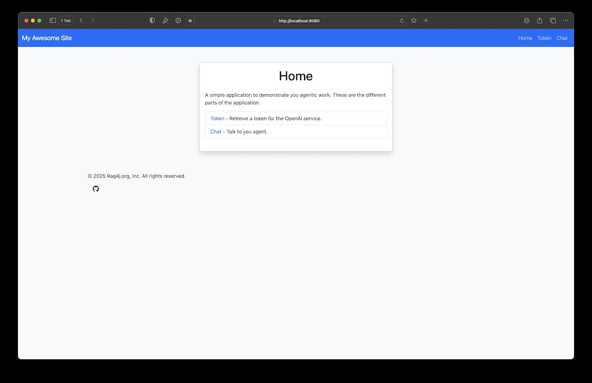
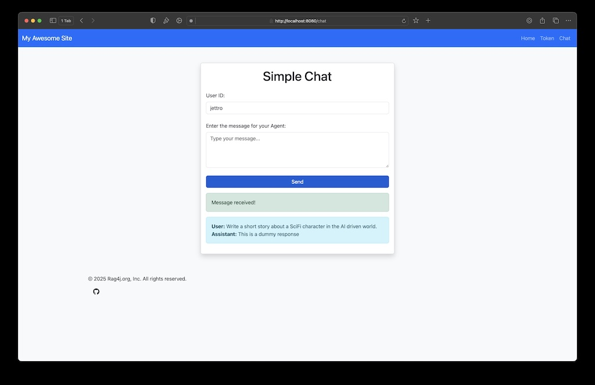

# Setup environment for workshop
The result of this step is a running web application with a dummy agent. You can test the application through the chat page.

```bash
./mvnw clean install -DskipTests
./mvnw clean install -pl web-app
./mvnw spring-boot:run -pl web-app
```

Open the website: http://localhost:8080. You should see an image like this.



Go to the chat page, submit a message and check if you receive a dummy response. If you receive the dummy response, you are ready for the workshop.



Hope to see you at the conference, in case of problems, check troubleshooting section below.

## Running the Web Project

### Basic Commands

```bash
# Clean and compile the entire project
./mvnw clean compile

# Run tests
./mvnw test

# Build the project (compile + test + package)
./mvnw clean install

# Start the web application
./mvnw spring-boot:run -pl web-app

# Start on a different port
./mvnw spring-boot:run -pl web-app -Dspring-boot.run.arguments=--server.port=8081
```

### Development Mode

```bash
# Run with hot reload enabled (if configured)
./mvnw spring-boot:run -pl web-app -Dspring-boot.run.fork=false

# Run in debug mode (attach debugger on port 5005)
./mvnw spring-boot:run -pl web-app -Dspring-boot.run.jvmArguments="-Xdebug -Xrunjdwp:transport=dt_socket,server=y,suspend=n,address=5005"
```

## Common Troubleshooting Scenarios

### 1. Java Version Issues

**Problem**: "Error: JAVA_HOME not found" or "Unsupported Java version"

**Solutions**:
```bash
# Check current Java version
java -version

# Check JAVA_HOME
echo $JAVA_HOME

# Set JAVA_HOME (macOS example)
export JAVA_HOME=$(/usr/libexec/java_home -v 17)

# Add to your shell profile (.zshrc, .bashrc, etc.)
echo 'export JAVA_HOME=$(/usr/libexec/java_home -v 17)' >> ~/.zshrc
```

### 2. Port Already in Use

**Problem**: "Port 8080 was already in use"

**Solutions**:
```bash
# Find what's using port 8080
lsof -i :8080

# Kill the process using the port (replace PID with actual process ID)
kill -9 <PID>

# Or run on a different port
./mvnw spring-boot:run -pl web-app -Dspring-boot.run.arguments=--server.port=8081
```

### 3. Dependencies Not Downloaded

**Problem**: "Could not resolve dependencies" or "Package does not exist"

**Solutions**:
```bash
# Force update dependencies
./mvnw clean install -U

# Clear local Maven repository cache
rm -rf ~/.m2/repository
./mvnw clean install

# Check if you're behind a proxy/firewall
./mvnw dependency:resolve -X  # Verbose output for debugging
```

### 4. Compilation Errors

**Problem**: "Compilation failure" or "package does not exist"

**Solutions**:
```bash
# Clean and rebuild everything
./mvnw clean compile

# Check for circular dependencies
./mvnw dependency:tree

# Verify all modules compile
./mvnw clean compile -pl core-agent
./mvnw clean compile -pl web-app
```

### 5. Memory Issues

**Problem**: "OutOfMemoryError" or slow performance

**Solutions**:
```bash
# Increase memory for Maven
export MAVEN_OPTS="-Xmx2g -XX:MaxMetaspaceSize=512m"

# Or set it for a single run
MAVEN_OPTS="-Xmx2g" ./mvnw clean install

# For the Spring Boot application
./mvnw spring-boot:run -pl web-app -Dspring-boot.run.jvmArguments="-Xmx1g"
```

### 6. IDE Integration Issues

**Problem**: IDE doesn't recognize the project structure

**Solutions**:
```bash
# Generate IDE-specific files
./mvnw idea:idea          # For IntelliJ IDEA
./mvnw eclipse:eclipse    # For Eclipse

# Reimport the project in your IDE after running these commands
```

### 7. Database Connection Issues (if applicable)

**Problem**: "Connection refused" or database errors

**Solutions**:
```bash
# Check if database is running (example for common databases)
# PostgreSQL
pg_isready -h localhost -p 5432

# MySQL
mysqladmin -h localhost -P 3306 ping

# Start local database (if using Docker)
docker-compose up -d database

# Check application.properties for correct database configuration
cat web-app/src/main/resources/application.properties
```

### 8. Network/Firewall Issues

**Problem**: Cannot download dependencies or reach external services

**Solutions**:
```bash
# Test internet connectivity
ping repo.maven.apache.org

# Configure Maven to use a proxy (if needed)
# Edit ~/.m2/settings.xml to add proxy configuration

# Use alternative repository (if corporate network)
./mvnw clean install -Dmaven.repo.remote=https://your-corporate-repo.com/maven2
```

### 9. Application Won't Start

**Problem**: Spring Boot application fails to start

**Solutions**:
```bash
# Check logs for specific error
./mvnw spring-boot:run -pl web-app > app.log 2>&1
cat app.log

# Verify application properties
cat web-app/src/main/resources/application.properties

# Check if all required profiles are active
./mvnw spring-boot:run -pl web-app -Dspring.profiles.active=dev,local

# Test with minimal configuration
./mvnw spring-boot:run -pl web-app -Dspring.main.web-application-type=servlet
```

### 10. Maven Wrapper Issues

**Problem**: "mvnw: command not found" or permission denied

**Solutions**:
```bash
# Make sure mvnw is executable
chmod +x ./mvnw

# Run from project root directory
pwd  # Should show the project root

# Use full path if needed
/Users/jettrocoenradie/Development/personal/agent4j/agent-workshop-assignments/mvnw --version

# On Windows, use mvnw.cmd instead
# mvnw.cmd --version
```

## Quick Health Check

Run these commands to verify everything is working:

```bash
# 1. Verify Java
java -version

# 2. Verify Maven wrapper
./mvnw --version

# 3. Verify project builds
./mvnw clean compile

# 4. Verify tests pass
./mvnw test

# 5. Start the application
./mvnw spring-boot:run -pl web-app

# 6. Test the endpoint (in another terminal)
curl http://localhost:8080
```

## Useful Development Commands

```bash
# Skip tests during build (faster development)
./mvnw clean install -DskipTests

# Run only specific test class
./mvnw test -Dtest=YourTestClass

# Run with verbose output
./mvnw clean install -X

# Check for dependency updates
./mvnw versions:display-dependency-updates

# Generate project reports
./mvnw site
```

## Windows-Specific Tips

### Command Line Basics

```powershell
# Use mvnw.cmd instead of ./mvnw
mvnw.cmd clean install

# Running the web application
mvnw.cmd spring-boot:run -pl web-app

# Setting environment variables (PowerShell)
$env:JAVA_HOME = "C:\Program Files\Java\jdk-17"

# Setting environment variables (Command Prompt)
set JAVA_HOME=C:\Program Files\Java\jdk-17
```

### Common Windows Issues

#### Path Length Limitations

**Problem**: "Path too long" errors during build or when accessing files

**Solutions**:
```powershell
# Enable long paths in Windows 10/11 (requires admin PowerShell)
New-ItemProperty -Path "HKLM:\SYSTEM\CurrentControlSet\Control\FileSystem" -Name "LongPathsEnabled" -Value 1 -PropertyType DWORD -Force

# Use shorter paths where possible
# Move project closer to root drive (e.g., C:\projects\)

# Or use subst to map a drive letter to a deep folder
subst X: C:\Users\username\long\path\to\project
# Then work from X:\
```

#### Line Ending Issues

**Problem**: Git shows all files as modified due to CRLF/LF issues

**Solutions**:
```powershell
# Configure Git for Windows
git config --global core.autocrlf true

# Or add .gitattributes file to your project with content:
# * text=auto
# *.sh text eol=lf
# *.bat text eol=crlf
# *.cmd text eol=crlf
```

#### Permission Issues

**Problem**: "Access denied" when running Maven commands

**Solutions**:
```powershell
# Run as administrator (right-click on PowerShell/CMD and select "Run as administrator")

# Check file permissions
icacls mvnw.cmd

# Reset permissions if needed
icacls mvnw.cmd /reset

# Make sure Java is installed with admin rights
```

#### Firewall/Antivirus Blocking Maven

**Problem**: Maven cannot download dependencies or connection errors

**Solutions**:
```powershell
# Check Windows Firewall settings
# Add exception for javaw.exe and mvnw.cmd in Windows Defender

# Temporarily disable Windows Defender real-time protection
# Warning: Only do this if you're certain the downloads are safe

# Use offline mode if you have the dependencies already
mvnw.cmd -o clean install
```

#### Command Prompt vs PowerShell

**Problem**: Different behavior between Command Prompt and PowerShell

**Solutions**:
```powershell
# Command Prompt syntax
mvnw.cmd clean install

# PowerShell syntax (for complex commands)
& .\mvnw.cmd clean install

# PowerShell with environment variables
$env:MAVEN_OPTS="-Xmx2g"; & .\mvnw.cmd clean install
```

#### JDK Installation & Path Issues

**Problem**: Multiple Java installations causing conflicts

**Solutions**:
```powershell
# List installed JDKs (with third-party tool like scoop)
scoop list

# Check PATH environment variable
$env:PATH

# Set JAVA_HOME in PowerShell (for current session)
$env:JAVA_HOME = "C:\Program Files\Java\jdk-17"

# Set JAVA_HOME permanently in Windows
# Search for 'Environment Variables' in Start menu
# Add/modify JAVA_HOME and ensure it's in PATH
```

#### IDE Integration on Windows

**Problem**: IDE not finding the correct JDK or Maven installation

**Solutions**:
```powershell
# Use the Windows-specific IDE settings:

# For IntelliJ IDEA:
# File > Settings > Build, Execution, Deployment > Build Tools > Maven
# Set Maven home directory to: your_project_path/.mvn/wrapper/maven-wrapper.jar

# For Eclipse:
# Window > Preferences > Java > Installed JREs
# Add your JDK installation
# Window > Preferences > Maven > Installations
# Add your Maven installation or use the embedded one
```

#### Performance Tuning for Windows

**Problem**: Slow build times on Windows

**Solutions**:
```powershell
# Increase memory allocation
$env:MAVEN_OPTS="-Xmx2g -XX:MaxMetaspaceSize=512m"

# Disable antivirus scanning for project directories
# Add exclusions in Windows Defender > Virus & threat protection > Manage settings

# Use RAM disk for Maven local repository (with third-party software)
# Then point Maven to use the RAM disk

# Avoid Windows Defender real-time scanning of Maven repository
# Add exclusion for %USERPROFILE%\.m2\repository
```

### Testing Windows Services (if applicable)

```powershell
# Install as Windows Service using Spring Boot (if applicable)
mvnw.cmd spring-boot:run -pl web-app -Dspring-boot.run.arguments="--spring.application.admin.enabled=true"

# Then use Windows Service Manager to control the service
# sc start/stop your_service_name
```
