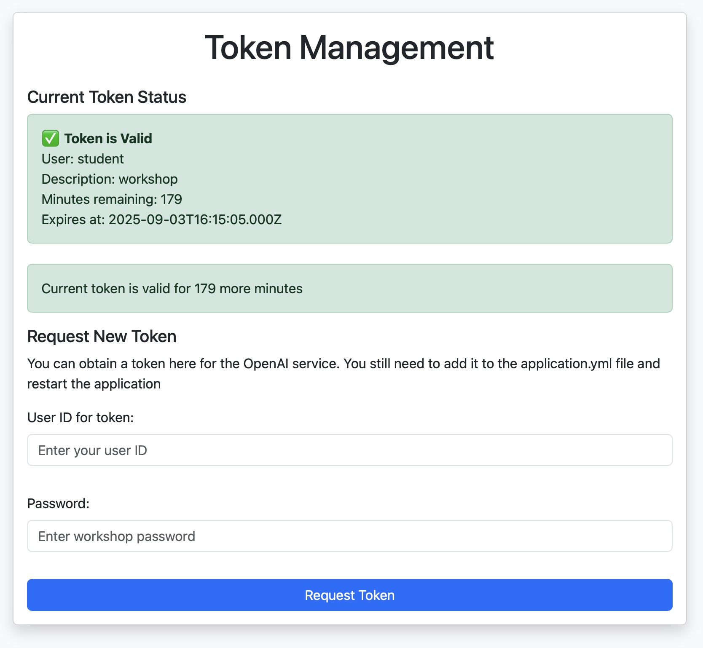

# Implement a plain Java Agent class

Start your journey with the next steps to test the built of the application and a dummy agent.

```
> Start the application, open the chat page, and send a message.
> You should receive a dummy response.
> In case of problems, go back to step_0
```

## Logging
The application uses out-of-the-box Spring Boot logging with Logback. The default log level is INFO. To see more details, change the log level to DEBUG in the application.yml file.

## Initialising the plain Java agent
In the steps below, you connect the Agent to OpenAI. You can use your own OpenAI account or our proxy to establish the connection.

```
> Add the Java agent to the dependencies of the web project
> Uncomment in pom.xml
> Change the active profile in application.yml to 'plain'
> Expose an Environment variable OPENAI_API_KEY, or use the proxy
> For the proxy: Uncomment 'openai.proxy.url' property
> Restart the application
When using the proxy:
> Open the tokens page. If no valid token is presented, request a new token. You need a password to fetch the token. Ask the instructor for the password.
> After receiving a new token, copy the value to the 'openai.proxy.token' property in the application.yml file.
> Restart the application and check the token page to see if it worked.
```
This is the token page with a configured proxy URL and token.



Now it is time to enter the chat page and ask a question about talks for Devoxx 2025. Most likely, you will receive an answer like `The Agent could not create an answer to your question.`. Check the logs for messages similar to these.

```
2025-09-02T16:38:06.787+02:00  INFO 93902 --- [agent-workshop-assignments] [nio-8080-exec-8] org.rag4j.webapp.ChatController          : Received chat message: Is there a talk about agents from jettro
2025-09-02T16:38:12.739+02:00  INFO 93902 --- [agent-workshop-assignments] [nio-8080-exec-8] o.rag4j.agent.reasoning.OpenAIReasoning  : Output message: Question: Is there a talk about agents
Think: The user wants to know if there is a talk about "agents". Since I have no direct action to search talks by keyword or topic, I must check if such a talk is mentioned or accessible. Given there are no actions available to search or list talks, I cannot retrieve specific talk data.
Action: No actions available
PAUSE
2025-09-02T16:38:12.740+02:00  INFO 93902 --- [agent-workshop-assignments] [nio-8080-exec-8] org.rag4j.agent.PlainJavaAgent           : Think: The user wants to know if there is a talk about "agents". Since I have no direct action to search talks by keyword or topic, I must check if such a talk is mentioned or accessible. Given there are no actions available to search or list talks, I cannot retrieve specific talk data.
```

The agent mentions it has no access to actions—time to add tools.

## Add Tools to the project

The agent uses a ToolsRegistry object to find the tools it can use. The ToolsRegistry is configured as a Spring Bean.

```
> Find the bean definition for the ToolsRegistry in the file PlainAgentConfigCommon.java
> Add the FindTalksByTitle and the FindTalksBySpeaker to the ToolsRegistry
> Restart the application
> Open the chat page and ask again, now you should get an answer with some talks.
```

Now try this
```
Ask the following two questions, one after the other:
- Is there a talk from jettro?
- Does he do the talk alone?
```
Did your second question get answered correctly? Most likely not. The agent has no memory of the previous question. Time to add memory.

## Add Memory to the project
To help the Agent create a better context for the LLM, we can add memory. The memory will store the previous questions and answers, providing them as context to the LLM.

```
> Add a Memory bean to the configuration in the file PlainAgentConfigCommon.java
- The windowedConversationMemory implementation is a good start
> Provide the Memory bean to the PlainJavaAgent, and fix compile errors
- Tip: There is a PlainMultiAgent class and some unit tests that need to be fixed as well.
> Add the question and the answer to the memory in the PlainJavaAgent class.
> In some situations, you might want to add Tool outputs to the memory as well.
- Add the Tool outputs to the memory in the PlainJavaAgent class (executeAction method).
- Note the If statement that prevents Observations from being added to the memory.
> Restart the application if needed, ask the same questions from the previous assignment again.
> Check the logs to see if the memory is used in the prompt sent to OpenAI.
```

## Create a multi-agent setup
Now that you have a working agent, it is time to create a multi-agent setup. You make the second agent that only answers questions about Science Fiction. The agent should respond with "I don't know" if the question is not about Science Fiction.

In this assignment, you will implement the Orchestrator pattern for a multi-agent setup. The config file SpringAiMultiAgentConfig.java is already provided for you with the orchestrator agent. You will configure the two other agents. To keep things simple, we will use the exact implementation for the SciFi agent as for the Conference agent. The only difference is that the SciFi agent has no tools. The orchestrator agent receives the available agents as tools and asks the questions to the correct agent.

```
> Switch the active profile to 'plain-multi' in the application.yml file
> Add the TalksAgent and the SciFiAgent beans to the configuration in PlainMultiAgentConfig.java
  - The TalksAgent Bean config can be copied from PlainAgentConfig.java
  - Remember to provide the memory to the agents.
  - The SciFiAgent needs no tools; the prompt should limit the agent to answering only questions about Science Fiction.
> Restart the application
> Open the chat page and ask a question about Science Fiction, for example: Who is considered the most famous science fiction character?
> Check the logs to see if the orchestrator agent asks the question to the SciFi agent.
> Ask a question about the conference, for example: Is there a talk from jettro?
> Check the logs to see if the orchestrator agent asks the question to the Talks agent.
```

Below is an example of the logs that you should see when the orchestrator agent asks a question to the SciFi agent.

```
2025-09-03T15:45:16.716+02:00  INFO 15617 --- [agent-workshop-assignments] [nio-8080-exec-3] o.rag4j.agent.reasoning.OpenAIReasoning  : Output message: Question: What is the most famou SciFi character
Think: To answer the question about the most famous science fiction character, I should consult the scifi_agent to get an expert perspective on famous sci-fi characters.
Action: scifi_agent: {"userId":"user1","message":"Who is considered the most famous science fiction character?"}
PAUSE
2025-09-03T15:45:16.716+02:00  INFO 15617 --- [agent-workshop-assignments] [nio-8080-exec-3] org.rag4j.agent.PlainJavaAgent           : Think: To answer the question about the most famous science fiction character, I should consult the scifi_agent to get an expert perspective on famous sci-fi characters.
2025-09-03T15:45:16.716+02:00  INFO 15617 --- [agent-workshop-assignments] [nio-8080-exec-3] org.rag4j.agent.PlainJavaAgent           : Action: scifi_agent with arguments: {"userId":"user1","message":"Who is considered the most famous science fiction character?"}
2025-09-03T15:45:16.717+02:00  INFO 15617 --- [agent-workshop-assignments] [nio-8080-exec-3] org.rag4j.agent.tools.ToolRegistry       : Executing tool: scifi_agent with arguments: {"userId":"user1","message":"Who is considered the most famous science fiction character?"}
```
