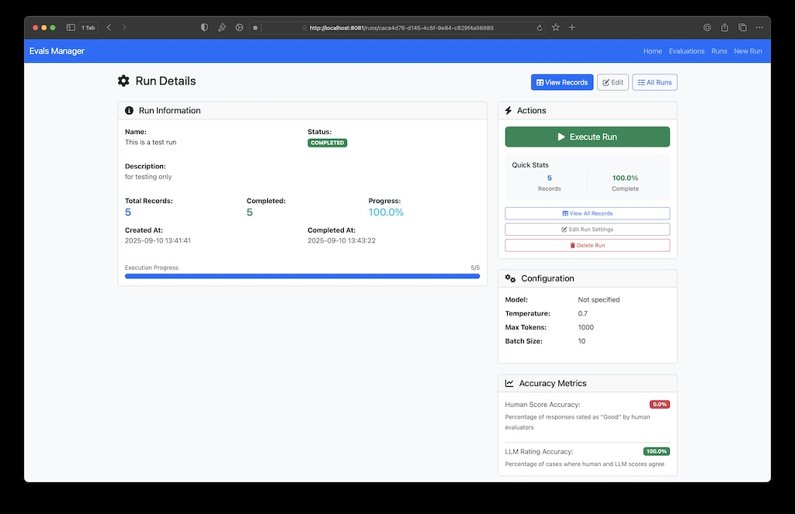

# Evaluating your Agent

Testing your agent is a crucial step to ensure it performs as expected. Output from an agent can be unpredictable, so it's important to evaluate its performance thoroughly. In this assignment, you'll learn how to test your agent using an end to end evaluation approach.

## Running the application
The evaluator is a web application similar to the agent ui. You can create a run, the run consists of records. Each record has an input. The file `input-questions.json` contains a list of questions you use as input. You can also add your own questions to this file. After creating the run, you can execute it. The application will send the input to your agent and store the output. It also stores an evaluation of the output by the llm. Next you should evaluate the output yourself and add a score `Good or Bad` with an explanation to each record. 

Two accuracies are calculated:
- Human accuracy: How accurate are the generated responses based on your evaluation.
- LLM accuracy: How accurate are the evaluations by the llm compared to the human evaluations

```text
> Copy the two properties from the application.yml file in the web-app to the evals-web-app application.yml file:
- openai.proxy.url
- openai.proxy.token
```

To run the application, use the following command:

```bash
./mvnw spring-boot:run -pl evals-web-app
```

The application will start on `http://localhost:8081`. You should see the following screen:


## Enter evaluations

Next step, create a new run. In the run screen you have a lot of extra fields. Beware, these are only for documentation purposes. The only required field is the name.

```text
> Click on the `View Runs` button to see the list of runs. You can also use the menu at the top right corner.
> Type in a name and other properties you want to document. Click on the `Create Run` button to create the run.
> In the next screen, push the `Exectue Run` button to start the run.
> Wait for the process to finish. This can take a while depending on the number of records.
```

Below is an example of the run screen, after executing the run. Note the Progress to be 100%.


Next, you want to evaluate the records yourself. Click on the `View Records` button to see the list of records. The screen should look like this:


You can ask details for each field of a record, you can also click on the eye icon to see the full data of the record. The screenshot below shows the details of a record.


```text
> Click on the `Details` button to see the details of a record.
> Update the human score by clicking the `Update Human Score` button.
> Do this for all the records.
> Check the accuracy of the run on the run details page.
```

## Improve the LLM evaluations
The LLM evaluations are done by the llm itself. It is important to understand how the evaluation is done. The prompt used for the evaluation can be found in the `LLMScoreService` class. You can improve the prompt to get better evaluations. A bigger model can also help.

```text
> Analyze the class LLMScoreService.java
> Improve the prompt used for the evaluation
> Change the model to a bigger one, replace the mini with gpt-4o
```

## Test the springai-multi agent

Test the springai-multi agent as well. You can use the same evaluator application. You need to change the agent bean in the configuration to use the SpringAIMultiAgent instead of the PlainJavaAgent.

```text
> Switch the spring profile to springai-multi
> Add a new question to the input-questions.json file: "What is the biggest bad guy in Star Wars?"
> Restart the application
> Create a new run in the evaluator application
> Execute the run
> Evaluate the records
> Check the accuracy of the run on the run details page.
```

